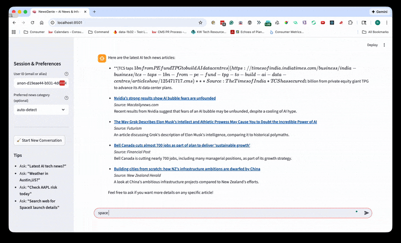
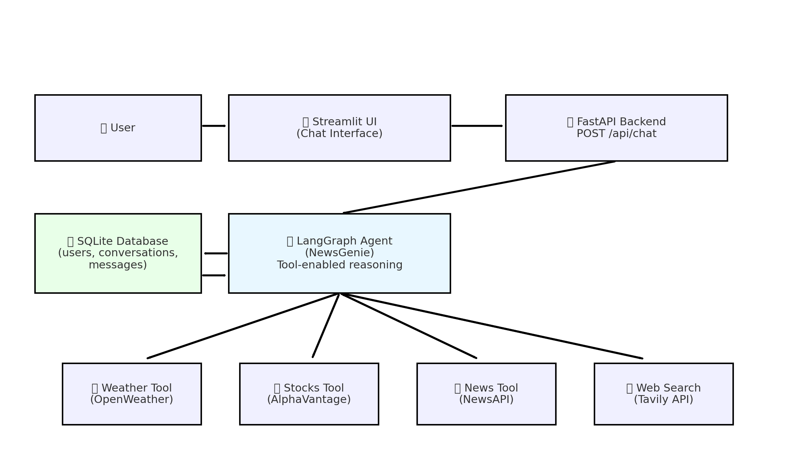

# 🧠 NewsGenie — AI-Powered News, Weather, Stocks & Web Search Assistant

An end-to-end agentic system built with **LangGraph**, **LangChain**, **Streamlit**, **FastAPI**, **SQLite**, and real-time APIs (NewsAPI, OpenWeatherMap, AlphaVantage, Tavily Search).  
Works with both **OpenAI** and **local LLMs via Ollama**.

---

## 🔧 Technology Stack


---

## 🎥 Live Demo (10 seconds)

Here’s a quick demonstration of NewsGenie in action:



## 🖼 NewsGenie Architecture Diagram

Below is the high-level system architecture for the NewsGenie agentic workflow:




NewsGenie intelligently handles:
- 📰 **Real-time news** (technology, sports, business, science, etc.)
- 🌦️ **Weather lookups**
- 📈 **Stock quotes + risk classification**
- 🔎 **Live web search** (Tavily Search API)
- 💬 **General conversational queries**
- 🧠 **Full conversation memory** stored in SQLite

This project demonstrates:
- LLM tool use  
- Agentic workflows  
- Fallback logic  
- Multi-tool decision making  
- Persistent conversation memory  
- Complete web UI  
- API-layer abstraction  

---

# 📘 Table of Contents

1. Overview  
2. Requirements  
3. Setup & Installation  
4. Environment Variables  
5. Project Structure  
6. Tools Overview  
7. LangGraph Agent Architecture  
8. FastAPI Backend  
9. Streamlit UI  
10. Example Queries  
11. Testing  
12. Troubleshooting  
13. Next Steps  

---

# 1. Overview

Modern users struggle with fragmented information sources.  
NewsGenie solves this by integrating:

- **Real-time APIs**  
- **LLM reasoning**  
- **LangGraph orchestrated tools**  
- **FastAPI for backend**  
- **Streamlit interactive UI**  

NewsGenie distinguishes:
- General questions  
- News requests  
- Stock queries  
- Weather lookups  
- Web search tasks  

… and calls the appropriate tool.

---

# 2. Requirements

Install:

- Python 3.11+
- pip
- sqlite3
- **Ollama**
  ```bash
  brew install ollama
  ollama pull llama3
  ollama serve
````

* Optional: OpenAI API Key

---

# 3. Setup & Installation

```bash
git clone <your_repo>
cd newsgenie-agent

python3 -m venv .venv
source .venv/bin/activate
pip install -r requirements.txt
```

---

# 4. Environment Variables

Create `.env`:

```dotenv
# --- LLM Providers ---
OPENAI_API_KEY=
OLLAMA_BASE_URL=http://localhost:11434
OLLAMA_MODEL=llama3
OPENAI_MODEL=gpt-4o-mini

# --- Weather ---
OPENWEATHER_API_KEY=
OPENWEATHER_BASE_URL=https://api.openweathermap.org/data/2.5/weather

# --- Stocks ---
ALPHAVANTAGE_API_KEY=
ALPHAVANTAGE_BASE_URL=https://www.alphavantage.co

# --- News ---
NEWS_API_KEY=
NEWS_API_BASE_URL=https://newsapi.org/v2

# --- Web Search (Tavily) ---
WEB_SEARCH_ENABLED=true
WEB_SEARCH_API_KEY=

# --- Database ---
DATABASE_URL=sqlite:///./app.db
```

Copy example file:

```bash
cp .env.example .env
```

---

# 5. Project Structure

```
app/
  agent/
    graph.py
    tools.py
    state.py
  memory/
    db.py
    schemas.py
  api/
    routes.py
  main.py
scripts/
  smoke_test.py
tests/
  test_tools.py
  test_graph.py
streamlit_app.py
requirements.txt
README.md
.env
```

---

# 6. Tools Overview (Weather, Stocks, News, Web Search)

NewsGenie uses LangChain’s `@tool` decorator to expose external functions to the LLM.

### Tools included:

| Tool              | Purpose                    | API            |
| ----------------- | -------------------------- | -------------- |
| `get_weather`     | Real weather               | OpenWeatherMap |
| `get_stock_quote` | Stock prices               | AlphaVantage   |
| `stock_risk_hint` | Classify risk              | Internal logic |
| `get_news`        | Top headlines & topic news | NewsAPI        |
| `web_search`      | General search             | Tavily Search  |

### The **full updated tools file** is in:

```
app/agent/tools.py
```

---

# 7. LangGraph Agent Architecture

```
User → AgentNode → (tool call?) → ToolNode → AgentNode → Response
```

Key components:

* **AgentState**
* **System Prompt (AGENT_SYSTEM_PROMPT)**
* **Agent Node (call_model)**
* **Tool Node**
* **Conditional edges** for tool invocation
* **SQLite persistence** via `run_agent_turn()`

LangGraph routes automatically:

* Weather → `get_weather`
* Stocks → `get_stock_quote`
* News → `get_news`
* Web search → `web_search`
* Errors → fallback logic

Your agent is defined in:

```
app/agent/graph.py
```

---

# 8. FastAPI Backend

Start backend:

```bash
uvicorn app.main:app --reload
```

### POST `/api/chat`

Body:

```json
{
  "external_user_id": "ray@example.com",
  "conversation_id": null,
  "user_text": "Latest AI tech news?"
}
```

Response:

```json
{
  "conversation_id": 12,
  "assistant": "Here are the latest AI developments..."
}
```

---

# 9. Streamlit UI (Full Chat Interface)

Start UI:

```bash
streamlit run streamlit_app.py
```

### Features:

* Sidebar:

  * User identity input
  * Preferred news category
  * Start new conversation button
* Chat interface using `st.chat_message`
* Persistent memory via your FastAPI+SQLite backend
* Tooltip hints for user queries

You can ask:

* “Weather in Austin?”
* “Check TSLA risk today”
* “Latest technology news about AI”
* “Search the web for SpaceX launch”

The UI file:

```
streamlit_app.py
```

---

# 10. Example Queries

### Weather

```
Weather in Tokyo?
```

### Stocks

```
Is AAPL high or low risk today?
```

### News (category auto-detect)

```
What’s happening in technology today?
```

### Topic news

```
Give me recent news about NVIDIA.
```

### Web search

```
Search the web for SpaceX launch details.
```

### Mixed request

```
Weather in Austin and latest AI news.
```

---

# 11. Testing

Run tests:

```bash
pytest -q
```

Run smoke test:

```bash
python scripts/smoke_test.py
```

---

# 12. Troubleshooting

### “Missing API key”

Add missing key in `.env`.

### “Ollama model not found”

Run:

```bash
ollama pull llama3
```

### “News not loading”

Check:

* NEWS_API_KEY
* NEWS_API_BASE_URL

### “Web search disabled”

Ensure:

```
WEB_SEARCH_ENABLED=true
WEB_SEARCH_API_KEY=your_tavily_key
```
